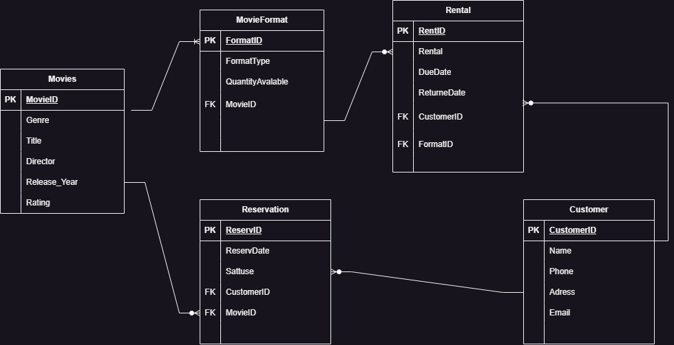

# RentalFlix ERD

## Overview
RentalFlix is a movie rental service aiming to replace its outdated system of tracking movies, customers, and rentals with a digital solution. This README provides an overview of the Entity-Relationship Diagram (ERD) designed to manage the service efficiently.

## ERD Diagram


## Explanation of Tables and Relationships

### Movie
- **MovieID (PK)**: Unique identifier for each movie.
- **Title**: Title of the movie.
- **Genre**: Genre or category of the movie.
- **Director**: Director of the movie.
- **ReleaseYear**: The year the movie was released.
- **Rating**: Movie rating (e.g., PG, PG-13, R).

### MovieFormat
- **FormatID (PK)**: Unique identifier for each movie format.
- **MovieID (FK)**: Identifier of the movie.
- **FormatType**: Type of format (DVD, Blu-ray, Digital).
- **QuantityAvailable**: Number of copies available for rent.

### Customer
- **CustomerID (PK)**: Unique identifier for each customer.
- **Name**: Name of the customer.
- **Address**: Address of the customer.
- **Phone**: Contact phone number.
- **Email**: Contact email address.

### Rental
- **RentalID (PK)**: Unique identifier for each rental record.
- **CustomerID (FK)**: ID of the customer who rented the movie.
- **FormatID (FK)**: ID of the movie format that was rented.
- **RentalDate**: Date when the movie was rented.
- **DueDate**: The date when the movie is due to be returned.
- **ReturnDate**: Date when the movie was returned (nullable).

### Reservation
- **ReservationID (PK)**: Unique identifier for each reservation.
- **CustomerID (FK)**: ID of the customer who reserved the movie.
- **MovieID (FK)**: ID of the reserved movie.
- **ReservationDate**: Date when the reservation was made.
- **Status**: Status of the reservation (active, fulfilled, canceled).

## Relationships
1. **Each movie can have multiple formats** (1:Many).
2. **Each customer can have multiple rentals** (1:Many).
3. **Each rental record is associated with one customer and one movie format** (Many:1).
4. **Each movie can have multiple reservations** (1:Many).
5. **Each reservation is associated with one customer and one movie** (Many:1).

## Key Concepts

### Primary Key (PK)
A Primary Key is a unique identifier for a record in a table. It ensures that each record can be uniquely identified. For example, `MovieID` in the Movie table is a Primary Key.

### Foreign Key (FK)
A Foreign Key is a field (or fields) in one table that uniquely identifies a row of another table. It establishes a relationship between the two tables. For example, `MovieID` in the MovieFormat table is a Foreign Key referencing `MovieID` in the Movie table.

### ERD Diagram Explanation

1. **Movie** table:
    - `MovieID` (PK)
    - `Title`
    - `Genre`
    - `Director`
    - `ReleaseYear`
    - `Rating`

2. **MovieFormat** table:
    - `FormatID` (PK)
    - `MovieID` (FK)
    - `FormatType`
    - `QuantityAvailable`

3. **Customer** table:
    - `CustomerID` (PK)
    - `Name`
    - `Address`
    - `Phone`
    - `Email`

4. **Rental** table:
    - `RentalID` (PK)
    - `CustomerID` (FK)
    - `FormatID` (FK)
    - `RentalDate`
    - `DueDate`
    - `ReturnDate`

5. **Reservation** table:
    - `ReservationID` (PK)
    - `CustomerID` (FK)
    - `MovieID` (FK)
    - `ReservationDate`
    - `Status`
```
+--------------+     +-----------------+     +-------------+     +-------------+     +-------------+
|    Movie     |     |  MovieFormat    |     |   Customer  |     |    Rental   |     | Reservation |
+--------------+     +-----------------+     +-------------+     +-------------+     +-------------+
| MovieID (PK) |<--->| FormatID (PK)   |<----| CustomerID  |<----| RentalID (PK) |<-->| ReservationID (PK) |
| Title        |     | MovieID (FK)    |     | Name        |     | CustomerID (FK)|     | CustomerID (FK)    |
| Genre        |     | FormatType      |     | Address     |     | FormatID (FK)  |     | MovieID (FK)       |
| Director     |     | QuantityAvailable|    | Phone       |     | RentalDate     |     | ReservationDate    |
| ReleaseYear  |     +-----------------+     | Email       |     | DueDate        |     | Status             |
| Rating       |                            +-------------+     | ReturnDate     |     +-------------+
+--------------+                                                  +-------------+
```